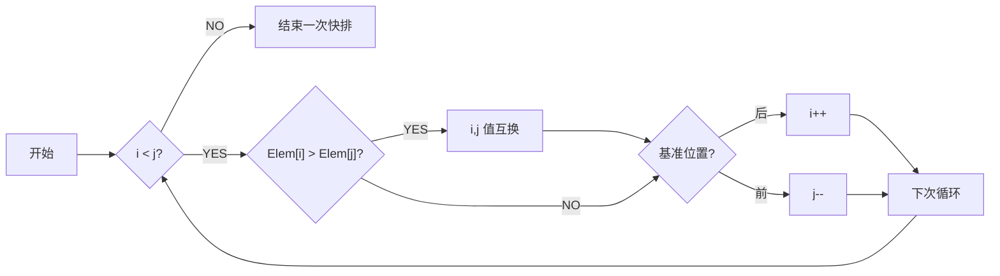

# 算法设计与分析

## 认识

### 基本概念

**算法**

- 有穷规则的集合；计算序列
- 特点
    - 输入（零个或多个）
    - 输出（至少一个）
    - 确定性
    - 有限性（执行次数、执行时间）
    - 可行性

**程序**：数据结构 + 算法

### P 问题与 NP 问题

**P 问题**：Polynomial Problem，多项式时间复杂度内能解的问题

**NP 问题**：Non-deterministic Polynomial Problem，**非确定性**多项式时间能解的问题，可以在多项式时间复杂度内对猜测进行验证

**NPC 问题**：NP-Complete，多项式时间内可转化为任意 NP 问题，可视为代表性 NP 问题

P 问题是确定计算模式下的易解问题，NP 问题是非确定性计算模式下的易验证问题，$P \subseteq NP$

### 算法渐进复杂性

理解：取 T(n) 高阶为渐进表达式


### 增长的阶

用增长的阶来衡量算法复杂度


g(n) 比 f(n) 结构要简单，可以近似代表 f(n)

#### 符号意义


#### 复杂性阶的理解举例


#### 理解


#### 各记号在等式和不等式中的意义


#### 性质


## 递归

### 定义

•	递归算法：一个直接或间接地调用自身的算法
•	递归函数：使用函数自身给出定义的函数
•	递归方程：对于递归算法，一般可把时间代价表示为一个递归方程
•	解递归方程最常用的方法是进行递归扩展

### 例

初始条件与递归方程是递归函数的两个要素

#### 例 1


#### Ackerman


#### 排列问题 Perm()


#### 整数划分问题


#### hanoi 汉诺塔问题


### 原理

也就是递归调用工作栈

递归程序逐层调用需要分配存储空间，一旦某一层被启用，就要为之开辟新的空间。而当一层执行完毕，释放相应空间掉，退到上一层。

- 递归程序逐层调用需要记录调用/返回地址（函数指针）及相关输入，返回参数。
- 递归程序逐层调用及返回时需要建立控制转移机制。

### 递归程序代价


## 分治

### 定义

- **基本思想**
    - 将问题分解成若干子问题，然后求解子问题。
    - 子问题较原问题更容易些，由此得出原问题的解，就是所谓的“**分而治之**”的意思。
    - 分治策略可以递归进行，即子问题仍然可以用分治策略来处理，但最后的问题要非常基本而简单。

- **步骤**
    - 把问题分解为 k 个**性质相同**、但规模较小的子问题，并求解这些子问题。
    - 逐步合并子问题的解，直到获得原问题的解
- **算法构架**
    - 
    - 

### 代价分析

（复杂度的推导必考）

==递归式==


- 参数
    - m：子问题总数量
    - k：需要求解的子问题数量（一般小于等于 m）
    - n：单个子问题的规模
    - f(n)：merge 的时间复杂度

推导式


==又可写成==
$$
T(N)=
\begin{cases}
\ O(N^{log_ba}),\ a>b^k \\
\ O(N^klogN),\ a=b^k \\
\ O(N^k),\ a<b^k \\
\end{cases}\\ \\
之于 \ T(N)=aT(N/b)+N^k
$$

==推导==


### 二分搜索技术

给定已按升序**排好序**的 n 个元素 a[0:n-1]，现要在这 n 个元素中找出一特定元素 x

#### 基本思想


#### 算法实现


#### 复杂性

做时间复杂度的推导必考
$$
T(n)=T(n/2)+1
$$


### 大整数的乘法

设计一个有效的算法，可以进行两个 n 位大整数的乘法运算

#### 小学生算法

一位位乘

复杂度为 O(n^2^)

#### 一种毫无进步的分治


#### 另一种分治


### strassen 矩阵乘法

暂且考虑方阵相乘

#### 传统方法


#### 垃圾的分治方法


#### 好分治


### 棋盘覆盖


#### 基本思想


#### 算法实现

```python
def chess_board(tr:int, tc:int, dr:int, dc:int, size:int):
    """
    棋盘覆盖问题
    param tr: 棋盘起始行坐标
    param tc: 棋盘起始列坐标
    param dr: 特殊方格的行号
    param dc: 特殊方格的列号
    param size:
    """
    if size==1:
        return
    t=
    s=size/2 # 分割棋盘
    if dr<tr+s and dc<tc+s
```


#### 复杂性


### 合并排序

就是归并排序


#### 基本思想


#### 递归算法

##### 实现


##### 复杂性


#### 非递归的分治算法

非递归：自底向上

递归：自顶向下


##### 实现


##### 复杂性

（长为 n/2）


#### 复杂性


### 快速排序

设基准 -> 划分子列 -> 递归

#### 算法实现




#### 复杂度


### 线性时间选择


一个结论：一般的选择问题可以在 O(n) 时间内得到解决 

#### 模仿快排的、很拉的分治算法


使用到类似于快排的算法


#### 改进的分治

思想：选择一个有用的基准值，让每一次递归都有效，能大概剔除 n/4 的规模


### 最接近点对问题


#### 一维


#### 二维

分治


推广到二维


#### 算法


第四部中的 X 与 Y 只要排一次序就行

#### 复杂度


### 循环赛程表问题


## 动态规划

### 定义

最优子结构性质

重叠子问题性质

**基本思想**

- 将问题分解成若干子问题，然后求解子问题。
- 子问题不是互相独立的
