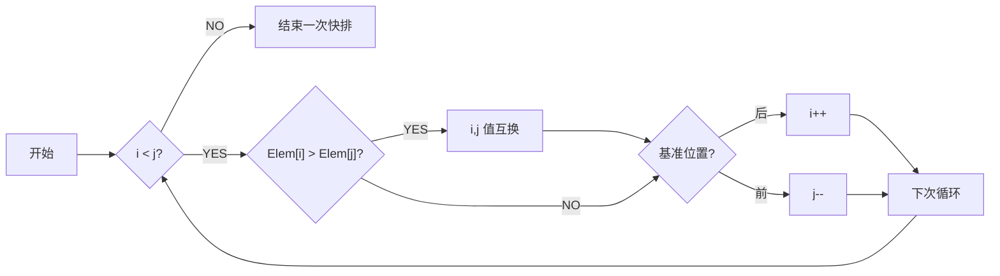

# 算法设计与分析

## 认识

### 基本概念

**算法**

- 有穷规则的集合；计算序列
- 特点
    - 输入（零个或多个）
    - 输出（至少一个）
    - 确定性
    - 有限性（执行次数、执行时间）
    - 可行性

**程序**：数据结构 + 算法

### P 问题与 NP 问题

**P 问题**：Polynomial Problem，多项式时间复杂度内能解的问题

**NP 问题**：Non-deterministic Polynomial Problem，**非确定性**多项式时间能解的问题，可以在多项式时间复杂度内对猜测进行验证

**NPC 问题**：NP-Complete，多项式时间内可转化为任意 NP 问题，可视为代表性 NP 问题

P 问题是确定计算模式下的易解问题，NP 问题是非确定性计算模式下的易验证问题，$P \subseteq NP$

### 算法渐进复杂性

理解：取 T(n) 高阶为渐进表达式


### 增长的阶

用增长的阶来衡量算法复杂度


g(n) 比 f(n) 结构要简单，可以近似代表 f(n)

#### 符号意义


#### 复杂性阶的理解举例


#### 理解


#### 各记号在等式和不等式中的意义


#### 性质


## 递归

### 定义

•	递归算法：一个直接或间接地调用自身的算法
•	递归函数：使用函数自身给出定义的函数
•	递归方程：对于递归算法，一般可把时间代价表示为一个递归方程
•	解递归方程最常用的方法是进行递归扩展

### 例

初始条件与递归方程是递归函数的两个要素

#### 例 1


#### Ackerman


#### 排列问题 Perm()


#### 整数划分问题


#### hanoi 汉诺塔问题


### 原理

也就是递归调用工作栈

递归程序逐层调用需要分配存储空间，一旦某一层被启用，就要为之开辟新的空间。而当一层执行完毕，释放相应空间掉，退到上一层。

- 递归程序逐层调用需要记录调用/返回地址（函数指针）及相关输入，返回参数。
- 递归程序逐层调用及返回时需要建立控制转移机制。

### 递归程序代价


## 分治

### 定义

- **基本思想**
    - 将问题分解成若干子问题，然后求解子问题。
    - 子问题较原问题更容易些，由此得出原问题的解，就是所谓的“**分而治之**”的意思。
    - 分治策略可以递归进行，即子问题仍然可以用分治策略来处理，但最后的问题要非常基本而简单。

- **步骤**
    - 把问题分解为 k 个**性质相同**、但规模较小的子问题，并求解这些子问题。
    - 逐步合并子问题的解，直到获得原问题的解
- **算法构架**
    - 
    - 

### 代价分析

（复杂度的推导必考）

==递归式==


- 参数
    - m：子问题总数量
    - k：需要求解的子问题数量（一般小于等于 m）
    - n：单个子问题的规模
    - f(n)：merge 的时间复杂度

推导式


==又可写成==
$$
T(N)=
\begin{cases}
\ O(N^{log_ba}),\ a>b^k \\
\ O(N^klogN),\ a=b^k \\
\ O(N^k),\ a<b^k \\
\end{cases}\\ \\
之于 \ T(N)=aT(N/b)+N^k
$$

==推导==


### 二分搜索技术

给定已按升序**排好序**的 n 个元素 a[0:n-1]，现要在这 n 个元素中找出一特定元素 x

#### 基本思想


#### 算法实现


#### 复杂性

做时间复杂度的推导必考
$$
T(n)=T(n/2)+1
$$


### 大整数的乘法

设计一个有效的算法，可以进行两个 n 位大整数的乘法运算

#### 小学生算法

一位位乘

复杂度为 O(n^2^)

#### 一种毫无进步的分治


#### 另一种分治


### strassen 矩阵乘法

暂且考虑方阵相乘

#### 传统方法


#### 垃圾的分治方法


#### 好分治


### 棋盘覆盖


#### 基本思想


#### 算法实现

```python
def chess_board(tr:int, tc:int, dr:int, dc:int, size:int):
    """
    棋盘覆盖问题
    param tr: 棋盘起始行坐标
    param tc: 棋盘起始列坐标
    param dr: 特殊方格的行号
    param dc: 特殊方格的列号
    param size:
    """
    if size==1:
        return
    t=
    s=size/2 # 分割棋盘
    if dr<tr+s and dc<tc+s
```


#### 复杂性


### 合并排序

就是归并排序


#### 基本思想


#### 递归算法

##### 实现


##### 复杂性


#### 非递归的分治算法

非递归：自底向上

递归：自顶向下


##### 实现


##### 复杂性

（长为 n/2）


#### 复杂性


### 快速排序

设基准 -> 划分子列 -> 递归

#### 算法实现




#### 复杂度


### 线性时间选择


一个结论：一般的选择问题可以在 O(n) 时间内得到解决 

#### 模仿快排的、很拉的分治算法


使用到类似于快排的算法


#### 改进的分治

思想：选择一个有用的基准值，让每一次递归都有效，能大概剔除 n/4 的规模


### 最接近点对问题


#### 一维


#### 二维

分治


推广到二维


#### 算法


第四部中的 X 与 Y 只要排一次序就行

#### 复杂度


### 循环赛程表问题


## 动态规划

### 定义

最优子结构性质

重叠子问题性质

**基本思想**

- 将问题分解成若干子问题，然后求解子问题。
- 子问题**不是互相独立的**

**方法**

- 自底向上求解

- 备忘录：递归，自顶向下

### 基本要素

**算法目标**

求解有某种最优性质的问题（离散型）。它可能有许多可行解，希望找到具有最优值的解。

**算法思想**

1. 动态规划算法将待求解问题分解成若干子问题，先求解**子问题**
2. 从这些子问题的解得到原问题的解。这些子问题往往**不互相独立**
3. 分解时得到的子问题数目可能很多，有些子问题被**重复计算**了很多次

**求解方法**

- 自底向上方式、自上而下方式
- 采用**备忘录方法**：求解过程中需保持已经解决的子问题的解，而在需要时再找出已求得的解，就可以避免大量的重复计算，节省时间。动态规划法用表记录所有已解的子问题的答案。不管该子问题以后是否会被用到，只要它被计算过，就将其结果填入表中。

**动态规划中的概念、名词术语**

| 概念、名词术语       | 解释                                                         |
| -------------------- | ------------------------------------------------------------ |
| 阶段                 | 把问题分成几个相互联系的有顺序的几个环节                     |
| 状态                 | 某一阶段的触发位置称为状态。通常一个阶段包含若干状态。       |
| 决策                 | 从某阶段的一个状态演变到下一阶段某状态的选择。特点：前一阶段的终点是后一阶段的起点，前一阶段的决策影响后一阶段的状态。 |
| 策略                 | 由考生到终点的全过程中，由每段决策组成的决策序列。           |
| 状态转移方程         | 描述由 k 阶段到 k+1 阶段状态的演变规律称为状态转移方程（用数学形式表达） |
| 目标函数与最优化概念 | 目标函数是衡量多阶段决策过程优劣的准则。最优化概念是在一定条件下找到一个途径，按照题目具体性质所确定的运算以后，使全过程的总效益达到最优。 |
| 动态规划             | 在多阶段决策问题中，各阶段采取的决策依赖于目前状态，并引起状态的转移以求得最优化过程。 |

最佳原理：==**一个最优化策略的子策略总是最优的**==

**动态规划的求解步骤**：

1. 找出最优解的性质，并刻画其结构特征
2. 递归地定义最优值（写出动态规划方程）
3. 以自底向上（或自顶向下）的方式计算出最优值
4. 根据计算最优值得到的信息，构造一个最优解

#### **动态规划的基本要素**

（填空、简答考）

动态规划算法的有效性依赖于问题本身所具有的两个重要性质：**最优子结构性质**和**子问题重叠性质**。

1. **最优子结构**

    当问题的最优解包含了其子问题的最优解时，称该问题具有最优子结构性质。

    证明用反证法：

    - 先假设由问题的最优解导出的子问题的解表示最优的，然后再设法证明在这个假设下可构造出一个比原问题最优解更好的解，从而导致矛盾。

2. **重叠子问题**

    在用递归算法自顶向下解问题时，每次产生的子问题并不总是新问题，**有些子问题被反复计算多次**。这种性质称为子问题的重叠性质。

    动态规划利用子问题的重叠性质，对每个子问题只解一次，并将解保存在一个表格中，在以后尽可能多利用这些子问题的解。

    特征：**不同的子问题个数随问题的大小呈多项式增长而非指数增长**。

**动态规划法与分治策略**

共性：都通过子问题求解原问题

方法：分治法是把一个规模为n的问题分成多个与原问题类型相同的较小的子问题，通过对子问题的求解，并把子问题的解合并起来，构造出整个问题的解；动态规划法先求子问题的解，通过求解子问题，构造原问题的解

==差异==：

1. **独立性**

    分治法各子问题互相独立，动态规划法的各子问题不独立

2. **子问题数目**

    动态规划法中设计的子问题，不独立的有很多，而独立的应只有**多项式级**；

    分治法设计的子问题数一般达**指数级**

3. **局部最优**

    动态规划法把问题分成许多子问题，每个子问题的解都是局部最优；分治法未必考虑最优性

4. **备忘录方法**

    动态规划法可采用备忘录方法

### 矩阵连乘

#### **问题叙述**

给定 n 个矩阵 $A_1$，$A_2$，……，$A_n$，其中 A~1~ 与 A~j+1~ 是可乘的，i=1,2,……，n-1，现要计算出这 n 个矩阵的连乘积 $A_1 A_2 … A_n$。

确定一种运算次序，使总的运算次数达到最少。


两个矩阵相乘时：

- A=(a~ij~)~m×k~，B=(b~ij~)~k×n~，C=(c~ij~)~m×n~

- C 有 m×n 个元素，需 **m×n×k 次乘法**，m×n×(k-1) 次加法

完全**加括号**的矩阵连乘积可递归地定义为：

1. 单个矩阵是完全加括号的；
2. 若矩阵链乘积 A 是完全加括号的，则 A 可表示为 2 个完全加括号的矩阵连乘积 B 和 C 的乘积并加括号，即  A=(BC)

#### 算法分析

1. 分析**最优解的结构**

    记 $A[i:j]$ 为 A~i~A~i+!~…A~j~，记 $m[i][j]$ 是计算 A~i~A~i+!~…A~j~ 时的最少乘法次数，显然 $A[i:i]=A_i$，$m[i][i]=0$

    特征：计算 $A[i:k]$ 和 $A[k+1:j]$ 的次序是最优的。

2. 建立递归关系

    假定计算 $A[1:n]$ 的一个最优次序在矩阵 A~k~ 和A~k+1~ 之间将矩阵链断开，1≤k<n

    $m[1][n]=m[1][k]+m[k+1][n]+p_0p_kp_n$

    *一般情况*

    假定计算 $A[i:j]$ 的一个最优次序在矩阵 A~k~ 和 A~k+1~ 之间将矩阵链断开，i≤k<j

    m[1] [n]=m[1] [k]+m[k+1] [n]+p~i-1~p~k~p~j~

    一般递推关系：

    

#### 计算最优值

不同子问题个数最多有 ${n}\choose{2}$+$n=\theta(n^2)$ 个。

依据递归式自底向上进行计算。在计算过程中保存已解决的子问题答案，每个子问题只计算一次。

```c
/*
r:矩阵序的长度
p[][]：存放矩阵序列维度的数组
m[][]：最优值数组
s[][]：记录最优断开位置的数组
*/
void MatrixChain(int *p, int n, int **m){
	int i,r,j,k,t;
    for (i=1;i<=n;i++) m[i][i]=0;
    for (r=2;r<=n;r++)
        // 每次循环计算出x个矩阵相乘时的最优运算次数，x=1到n-1
        for (i=1;i<=n-r+1;i++){
            // 斜着
			j = i+r-1; // x
            m[i][j]=m[i+1][j]+p[i-1]*p[i]*p[j];			//初始化
            for (k=i+1;k<j;k++){
                t=m[i][k]+m[k+1][j]+p[i-1]*p[k]*p[j];
                if (t<m[i][j])
                    m[i][j]=t;
            }
        }
}
```


**复杂度**

计算时间上界为 $O(n^3)$，空间为 $O(n^2)$

#### 构造最优解

引入分割点标记 $s[i][j]$，确定加括号方式，构造最优解

```c
void Traceback(int i, int j, int **s)
{
    if (i==j) return;
    Traceback(i,s[i][j],s);
    Traceback(s[i][j]+1,j,s);
    cout << "Multiply A "<< i << ", " << s[i][j];
    cout << " and A " << (s[i][j]+1) << " ," << j << endl;
}
```

### 最长公共子序列

**概念**

1. 子序列：若给定序列 $X=\{x_1,x_2,…,x_m\}$，则另一序列 $Z=\{z_1,z_2,…,z_k\}$是 X 的子序列，是指存在一个严格递增下标序列 ${i_1,i_2,…,i_k}$ 使得对于所有 j=1,2,…,k 有：$Z_j=X_{ij}$


1. 公共子序列：给定两个序列 X 和 Y，当另一序列 Z 既是 X 的子序列又是 Y 的子序列时，称 Z 是序列 X 和 Y 的公共子序列

设序列 $X=\{x_1,x_2,…,x_m\}$ 和 $Y=\{y_1,y_2,…,y_n\}$ 的最长公共子序列为 $Z=\{z_1,z_2,…,z_k\}$，则

1. 若 $x_m=y_n$，则 $z_k=x_m=y_n$，且 Z~k-1~ 是 X~m-1~ 和 Y~n-1~ 的最长公共子序列
2. 若 $x_m≠y_n$ 且 $z_k≠x_m$，则 Z 是 X~m-1~ 和 Y 的最长公共子序列
3. 若 $x_m≠y_n$ 且 $z_k≠y_n$，则 Z 是 X 和 Y~n-1~ 的最长公共子序列

当 i=0 或 j=0 时，空序列是 $X_i$ 和 $Y_j$ 的最长公共子序列，此时 $c[i][j]=0$。

其他情况下的递归关系：
$$
c[i][j]=\begin{cases}0,i=0、j=0\\c[i-1][j-1]+1,i、j＞0;x_i=y_j\\max(c[i][j-1],c[i-1][j]),i、j>0;x_i≠y_j\end{cases}
$$
子问题空间中，总共有 $\theta(mn)$ 个不同的子问题，用动态规划算法自底向上计算最优值能提高算法的效率。

```c
/*
c[i][j]：存储Xi和Yj的最长公共子序列的长度
b[i][j]：记录c[i][j]的值是由哪个子问题的解得到的
*/

//计算最优值
void LCSLength(int m, int n, char *x, char *y, int **c, int **b)
{
    int i,j;
    for (i=1;i<=m;i++)
        c[i][0]=0;
    for (i=1;i<=n;i++)
        c[0][i]=0;
    for(i=1;i<=m;i++)
    {
        for(j=1;j<=n;j++)
        {
            if (x[i]==y[j]){
                c[i][j]=c[i-1][j-1]+1;
                b[i][j]=1;					//指↖
            }
            else if(c[i-1][j]>=c[i][j-1]){
				c[i][j]=c[i-1][j];
                b[i][j]=2;					//指↑
            }
            else{
                c[i][j]=c[i][j-1];
                b[i][j]=3;					//指←
			}
		}
	}
}

//构造最长公共子序列
void LCS(int i, int j, char *x, int **b)
{
    if (i==0 || j==0)
        return;
    if (b[i][j]==1)
    {
        LCS(i-1,j-1,x,b);
        cout << x[i];
	}
    else if(b[i][j]==2)
        LCS(i-1,j,x,b);
    else
        LCS(i,j-1,x,b);
}
```

### 最大子段和

#### **问题描述**

给定由 n 个整数组成的序列 $a_1,a_2,a_3……,a_n$，求该序列形如 $\sum{a_k}$ 的子段和的最大值。

枚举：$O(n^3)$

递推：$O(n^2)$

#### **分治策略**

将序列 $a[1:n]$ 分为长度相等的两段 $a[1:n/2]$ 和 $a[n/2+1:n]$，分别求出这两段的最大子段和 S~1~，S~2~

$a[1:n]$ 的最大子段和 S 有三种可能：

$S=S~1$，$S=S_2$ 或 $S=\sum_{k=i}^{j}{a_k}$，$i≤n/2，n/2+1≤j$

对于第三种情况只需求得 S~1~ 中 i 到 n/2 最大子段和，S~2~ 中 n/2+1 到 j 最大子段和，二者相加 S=S~1~’+S~2~’（因为比包含 n/2 处的数）

时间复杂度递推式： 
$$
T(n)=\begin{cases}2T(n/2)+O(n),n>C\\O(1),n≤C\end{cases}
$$
由上解得 $T(n)=O(nlogn)$

#### **动态规划**

对 $a[1:j]$，记 $b[j]$，$1≤j≤n$

$b[j]=max$~{1≤i≤j}~{$\sum_{k=i}^{j}{a_k}$}  **以 j 为末尾位置的最大子段和**

$a[1:n]$ 的最大子段和 $S=max$~{1≤j≤n}~{$b[j]$}，即 j 从 1 到 n 的最大 b[j]

有递推：
$$
b[j]=max\{b[j-1]+a[j],a[j]\}
$$

```c
int MaxSum(int n, int *a)
{
    int sum=0,b=0;
    for (int i =1; i<=n;i++)
    {
        if (b>0) b+=a[i];
        else b=a[i];
        if(b>sum) sum=b;
	}
    return sum;
} // 好妙
```

复杂性：$O(n)$

#### **推广**：**最大子矩阵和问题**

给定一个 m 行 n 列的整数矩阵 A，试求矩阵 A 的一个子矩阵，使其各元素之和为最大。

思想：将多行压成一行

```c
int MaxSum2(int m, int n, int **a)
{
    int sum=0,*b=new int [n+1];
    for (int i =1;i<=m;i++){
		for (int k=1;k<=n;k++) b[k]=a[i][k]; // 将i行数据存进b数组中
        for (int j=i+1;j<=m;j++){
			for (int k=1; k<=n;k++) b[k]+=a[j][k]; // 将新一行累加到b数组中
            int max=MaxSum(n,b); // 获取加上这行后，所得的最大子段和（降维）
            if(max>sum) sum=max;
        }
    }
    return sum;
}
```

复杂性：$O(m^2n)$

###  凸多边形最优三角剖分

**凸多边形**：用多边形顶点的逆时针序列表示凸多边形，即 P={v~0~，v~1~，…，v~n-1~} 表示具有 n 条边的凸多边形。

**弦**：若 v~i~ 与 v~j~ 是多边形上不相邻的 2 个顶点，则线段 v~i~v~j~ 称为多边形的一条弦。弦将多边形分割成 2 个多边形 {v~i~，v~i+1~，…，v~j~} 和 {v~j~，v~j+1~，…，v~i~}

凸多边形最优三角剖分：给定凸多边形 P，以及定义在由多边形的边和弦组成的三角形上的权函数 w。确定该凸多边形的三角剖分，使得该三角剖分中诸三角形上权之和为最小。

与矩阵连乘思想类似，都是找到一颗最优的语法树


**递归结构**

定义 $t[i][j]$，1 ≤ i＜j ≤ n 为凸子多边形 {v~i-1~，v~i~，…，v~j~} 的最优三角剖分所对应的权函数值，即其最优值。

$t[i][j]=t[i][k]+t[k+1][j]+$(△v~i-1~v~k~v~j~ 权值)

**递归定义**


时间复杂性：$O(n^3)$ 

空间复杂性：$O(n^2)$

