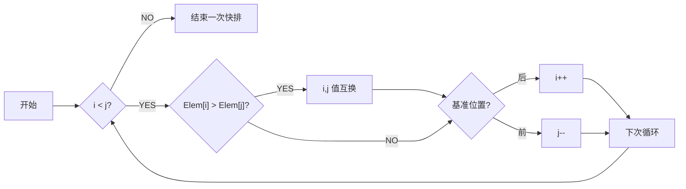

题型

填空 10-12 分，概念

单选 20 分

综合大题 4道，其中 2-3 小题

- 算法设计，写出复杂度的递推公式（分治法），并推导；动态方程/递归方程
- 程序填空（回溯法）
- 手工操作题（分支限界法：解空间树、队列变化次序……）

# 算法设计与分析

## 认识

### 基本概念

**算法**

- 有穷规则的集合，其中的规则规定了解决某一特殊问题的**一系列运算**；计算序列
- 特点
    - 输入（零个或多个）
    - 输出（至少一个）
    - 确定性
    - 有限性（执行次数、执行时间）
    - 可行性

**程序**：数据结构 + 算法

### P 问题与 NP 问题

（**会考概念**）

**P 问题**：Polynomial Problem，多项式时间复杂度内能解的问题

**NP 问题**：Non-deterministic Polynomial Problem，**非确定性**多项式时间能解的问题，可以在多项式时间复杂度内对猜测进行验证

**NPC 问题**：NP-Complete，多项式时间内可转化为任意 NP 问题，可视为代表性 NP 问题

P 问题是确定计算模式下的易解问题，NP 问题是非确定性计算模式下的易验证问题，$P \subseteq NP$

### 算法渐进复杂性

粗略理解：取 T(n) 的**高阶**，即为渐进表达式


### 增长的阶

用增长的阶来衡量算法复杂度


g(n) 比 f(n) 结构要简单，可以近似代表 f(n)

#### 符号意义

（**看**）


#### 复杂性阶的理解举例


#### 理解


#### 各记号在等式和不等式中的意义


#### 性质


## 递归

### 定义

- 递归算法：一个直接或间接地调用自身的算法
- 递归函数：使用函数自身给出定义的函数
- 递归方程：对于递归算法，一般可把时间代价表示为一个递归方程
- 解递归方程最常用的方法是进行递归扩展
    - 边界条件
    - 递归关系

### 例

**初始条件**与**递归方程**是递归函数的两个要素

#### 例 1


#### Ackerman


#### 排列问题 Perm() 


为便于理解，以 {1,2,3,4,5,6} 为例：

1 2 3 4 5 6 –> **1** 2 3 4 5 6 –> **1** **2** 3 4 5 6 –> **1 2 3** 4 5 6 –> **1 2 3 4** 5 6 –> **1 2 3 4 5** 6 –> **1 2 3 4** 6 5 –> **1 2 3 4 6** 5

```c
template<class Type>
void Perm(Type list[],int k, int m){			//产生list[k:m]的所有排列
	if(k==m){									//只剩下一个元素，到达递归的最底层
		for (int i=0;i<=m;i++)
            cout << list[i];
        cout << endl;
    }
    else{										//还有多个元素待排列，递归产生排列
        for (int i=k;i<=m;i++)
        {
            Swap(list[k],list[i]);
            Perm(list,k+1,m);
            Swap(list[k],list[i]);				//复位，保证所有元素都能依次做前缀
		}
    }
}

template<class Type>
inline void Swap(Type &a, Type &b)
{
    Type temp=a;
    a = b;
    b = temp;
}
```

#### 整数划分问题


1. q(n,1)=1，n≥1。当最大加数 n~1~ 不大于 1 时，任何正整数n只有一种划分形式，即 n=1+1+…+1
2. q(n,m)=q(n,n)，m≥n。最大加数 n~1~ 不能大于 n。
3. q(n,n)=1+q(n,n-1)。正整数 n 的划分由 n~1~=n 的划分和 n~1~≤n-1 的划分组成；n~1~=n 时，划分仅有一种。
4. q(n,m-1)+q(n-m,m)，n>m>1。正整数 n 的最大加数 n~1~ 不大于 m 的划分由 n~1~=m 的划分和 n~1~≤m-1 的划分组成。

#### hanoi 汉诺塔问题


### 原理

也就是**递归调用工作栈**

递归程序逐层调用需要分配存储空间，一旦某一层被启用，就要为之开辟新的空间。而当一层执行完毕，释放相应空间掉，退到上一层。

- 递归程序逐层调用需要记录调用/返回地址（函数指针）及相关输入，返回参数。
- 递归程序逐层调用及返回时需要建立控制转移机制。

**递归优点**：结构清晰，可读性强

**递归缺点**：递归算法的运行效率较低，无论是耗费的计算时间还是占用的存储空间都比非递归算法要多

**解决方法**：在递归算法中消除递归调用，使其转化为非递归算法。可采用一个用户定义的栈来模拟系统的递归调用工作栈。

### 递归程序代价


## 分治

### 定义

- **基本思想**
    - 将问题分解成若干子问题，然后求解子问题。
    - 子问题较原问题更容易些，由此得出原问题的解，就是所谓的“**分而治之**”的意思。
    - 分治策略可以递归进行，即子问题仍然可以用分治策略来处理，但最后的问题要非常基本而简单。

- **步骤**
    - 把问题分解为 k 个**性质相同**、但规模较小的子问题，并求解这些子问题。
    - 逐步合并子问题的解，直到获得原问题的解
- **算法构架**
    - 
    - 

### 代价分析

（**复杂度的推导必考**）

==递归式==


- 参数
    - m：子问题总数量
    - k：一次分解的子问题数量（一般小于等于 m）
        - n/m：单个子问题的规模
    - f(n)：merge 的时间复杂度

推导式


==又可写成==
$$
T(N)=
\begin{cases}
\ O(N^{log_ba}),\ a>b^k \\
\ O(N^klog_bN),\ a=b^k \\
\ O(N^k),\ a<b^k \\
\end{cases}\\ \\
之于 \ T(N)=aT(N/b)+N^k
$$

==推导==


### 二分搜索技术

给定已按升序**排好序**的 n 个元素 a[0:n-1]，现要在这 n 个元素中找出一特定元素 x

#### 基本思想


#### 算法实现


#### 复杂性

做时间复杂度的推导必考
$$
T(n)=T(n/2)+1
$$


### 大整数的乘法

设计一个有效的算法，可以进行两个 n 位大整数的乘法运算

#### 小学生算法

一位位乘

复杂度为 O(n^2^)

#### 一种毫无进步的分治


#### 另一种分治


### strassen 矩阵乘法

暂且考虑方阵相乘

#### 传统方法


#### 垃圾的分治方法


#### 好分治


### 棋盘覆盖

不考


#### 基本思想


#### 算法实现

```python
def chess_board(tr:int, tc:int, dr:int, dc:int, size:int):
    """
    棋盘覆盖问题
    param tr: 棋盘起始行坐标
    param tc: 棋盘起始列坐标
    param dr: 特殊方格的行号
    param dc: 特殊方格的列号
    param size:
    """
    if size==1:
        return
    t=
    s=size/2 # 分割棋盘
    if dr<tr+s and dc<tc+s
```


#### 复杂性


### 合并排序

就是归并排序


#### 基本思想


#### 递归算法

##### 实现


##### 复杂性


#### 非递归的分治算法

非递归：自底向上

递归：自顶向下


##### 实现


##### 复杂性

（长为 n/2）


#### 复杂性


### 快速排序

设基准 -> 划分子列 -> 递归

#### 算法实现




#### 复杂度


### 线性时间选择


一个结论：一般的选择问题可以在 O(n) 时间内得到解决 

#### 模仿快排的、很拉的分治算法


使用到类似于快排的算法


#### 改进的分治

思想：选择一个有用的基准值，让每一次递归都有效，能大概剔除 n/4 的规模


### 最接近点对问题

不会出大题


#### 一维


#### 二维

分治


推广到二维


#### 算法


第四部中的 X 与 Y 只要排一次序就行

#### 复杂度


### 循环赛程表问题

不考


## 动态规划

### 定义

最优子结构性质

重叠子问题性质

**基本思想**

- 将问题分解成若干子问题，然后求解子问题。
- 子问题**不是互相独立的**

**方法**

- 自底向上求解

- 备忘录：递归，自顶向下

### 基本要素

**算法目标**

求解有某种最优性质的问题（离散型）。它可能有许多可行解，希望找到具有最优值的解。

**算法思想**

1. 动态规划算法将待求解问题分解成若干子问题，先求解**子问题**
2. 从这些子问题的解得到原问题的解。这些子问题往往**不互相独立**
3. 分解时得到的子问题数目可能很多，有些子问题被**重复计算**了很多次

**求解方法**

- 自底向上方式、自上而下方式
- 采用**备忘录方法**：求解过程中需保持已经解决的子问题的解，而在需要时再找出已求得的解，就可以避免大量的重复计算，节省时间。动态规划法用表记录所有已解的子问题的答案。不管该子问题以后是否会被用到，只要它被计算过，就将其结果填入表中。

**动态规划中的概念、名词术语**

| 概念、名词术语       | 解释                                                         |
| -------------------- | ------------------------------------------------------------ |
| 阶段                 | 把问题分成几个相互联系的有顺序的几个环节                     |
| 状态                 | 某一阶段的触发位置称为状态。通常一个阶段包含若干状态。       |
| 决策                 | 从某阶段的一个状态演变到下一阶段某状态的选择。特点：前一阶段的终点是后一阶段的起点，前一阶段的决策影响后一阶段的状态。 |
| 策略                 | 由考生到终点的全过程中，由每段决策组成的决策序列。           |
| 状态转移方程         | 描述由 k 阶段到 k+1 阶段状态的演变规律称为状态转移方程（用数学形式表达） |
| 目标函数与最优化概念 | 目标函数是衡量多阶段决策过程优劣的准则。最优化概念是在一定条件下找到一个途径，按照题目具体性质所确定的运算以后，使全过程的总效益达到最优。 |
| 动态规划             | 在多阶段决策问题中，各阶段采取的决策依赖于目前状态，并引起状态的转移以求得最优化过程。 |

最佳原理：==**一个最优化策略的子策略总是最优的**==

**动态规划的求解步骤**：

1. 找出最优解的性质，并刻画其结构特征
2. 递归地定义最优值（写出动态规划方程）
3. 以自底向上（或自顶向下）的方式计算出最优值
4. 根据计算最优值得到的信息，构造一个最优解

#### **动态规划的基本要素**

（填空、简答考）

动态规划算法的有效性依赖于问题本身所具有的两个重要性质：**最优子结构性质**和**子问题重叠性质**。

1. **最优子结构**

    当问题的最优解包含了其子问题的最优解时，称该问题具有最优子结构性质。

    证明用反证法：

    - **先假设由问题的最优解导出的子问题的解不是最优的，然后再设法证明在这个假设下可构造出一个比原问题最优解更好的解，从而导致矛盾。**
        1. 构建一个问题的最优解 $\pi$
        2. 构建其子问题的一个解（一个递归式），接下来开始证明这个解是最优解
        3. 如果这个解不是子问题的最优解，则满足某一个不等式，使得另有一个解 $\pi'$ 成为子问题的最优解
        4. 这个解 $\pi'$ 加上第一个元素后将会成为整个问题的最优解
        5. 这与 $\pi$ 是问题的最优解矛盾，不等式推翻，证明最优子结构性质

2. **重叠子问题**

    在用递归算法自顶向下解问题时，每次产生的子问题并不总是新问题，**有些子问题被反复计算多次**。这种性质称为子问题的重叠性质。

    动态规划利用子问题的重叠性质，对每个子问题只解一次，并将解保存在一个表格中，在以后尽可能多利用这些子问题的解。

    特征：**不同的子问题个数随问题的大小呈多项式增长而非指数增长**。

**动态规划法与分治策略**

共性：都通过子问题求解原问题

方法：分治法是把一个规模为n的问题分成多个与原问题类型相同的较小的子问题，通过对子问题的求解，并把子问题的解合并起来，构造出整个问题的解；动态规划法先求子问题的解，通过求解子问题，构造原问题的解

==差异==：

1. **独立性**

    分治法各子问题互相独立，动态规划法的各子问题不独立

2. **子问题数目**

    动态规划法中设计的子问题，不独立的有很多，而独立的应只有**多项式级**；

    分治法设计的子问题数一般达**指数级**

3. **局部最优**

    动态规划法把问题分成许多子问题，每个子问题的解都是局部最优；分治法未必考虑最优性

4. **备忘录方法**

    动态规划法可采用备忘录方法

### 矩阵连乘

#### **问题叙述**

给定 n 个矩阵 $A_1$，$A_2$，……，$A_n$，其中 A~1~ 与 A~j+1~ 是可乘的，i=1,2,……，n-1，现要计算出这 n 个矩阵的连乘积 $A_1 A_2 … A_n$。

确定一种运算次序，使总的运算次数达到最少。


两个矩阵相乘时：

- A=(a~ij~)~m×k~，B=(b~ij~)~k×n~，C=(c~ij~)~m×n~

- C 有 m×n 个元素，需 **m×n×k 次乘法**，m×n×(k-1) 次加法

完全**加括号**的矩阵连乘积可递归地定义为：

1. 单个矩阵是完全加括号的；
2. 若矩阵链乘积 A 是完全加括号的，则 A 可表示为 2 个完全加括号的矩阵连乘积 B 和 C 的乘积并加括号，即  A=(BC)

#### 算法分析

1. 分析**最优解的结构**

    记 $A[i:j]$ 为 A~i~A~i+!~…A~j~，记 $m[i][j]$ 是计算 A~i~A~i+!~…A~j~ 时的最少乘法次数，显然 $A[i:i]=A_i$，$m[i][i]=0$

    特征：计算 $A[i:k]$ 和 $A[k+1:j]$ 的次序是最优的。

2. 建立递归关系

    假定计算 $A[1:n]$ 的一个最优次序在矩阵 A~k~ 和A~k+1~ 之间将矩阵链断开，1≤k<n

    $m[1][n]=m[1][k]+m[k+1][n]+p_0p_kp_n$

    *一般情况*

    假定计算 $A[i:j]$ 的一个最优次序在矩阵 A~k~ 和 A~k+1~ 之间将矩阵链断开，i≤k<j

    m[1] [n]=m[1] [k]+m[k+1] [n]+p~i-1~p~k~p~j~

    一般递推关系：

    

#### 计算最优值

不同子问题个数最多有 ${n}\choose{2}$+$n=\theta(n^2)$ 个。

依据递归式自底向上进行计算。在计算过程中保存已解决的子问题答案，每个子问题只计算一次。

```c
/*
r:矩阵序的长度
p[]：存放矩阵序列维度的数组
m[][]：最优值数组
s[][]：记录最优断开位置的数组
*/
void MatrixChain(int *p, int n, int **m){
	int i,r,j,k,t;
    for (i=1;i<=n;i++) m[i][i]=0;
    for (r=2;r<=n;r++)
        // 每次循环计算出x个矩阵相乘时的最优运算次数，x=1到n-1
        for (i=1;i<=n-r+1;i++){
            // 斜着
			j = i+r-1; // x
            m[i][j]=m[i+1][j]+p[i-1]*p[i]*p[j];			//初始化
            for (k=i+1;k<j;k++){
                t=m[i][k]+m[k+1][j]+p[i-1]*p[k]*p[j];
                if (t<m[i][j])
                    m[i][j]=t;
            }
        }
}
```

```python
def matrix_chain(n: int, p: List[int]) -> tuple:
    """
    计算最优值关系矩阵
    :param n: 连乘矩阵的个数
    :param p: 矩阵序列维度的列表
    :return: 最优断开位置的二维列表, 备忘录
    """
    m: List[List[int]] = [
        [0 for i in range(n + 1)] for j in range(n + 1)]  # 初始记录矩阵全设为零
    s: List[List[int]] = [
        [0 for i in range(n + 1)] for j in range(n + 1)]  # 记录最优断开位置的数组
    for r in range(2, n + 1):
        # 对每个对角线
        for i in range(1, n - r + 2):
            # 对每行
            j = i + r - 1  # 对角线长

            m[i][j] = m[i][i] + m[i + 1][j] + \
                p[i - 1] * p[i] * p[j]  # 初始化 m[i][j]
            s[i][j] = i  # 记录断开位置

            for k in range(i + 1, j):
                # 寻找m[i][j]最小值
                t = m[i][k] + m[k + 1][j] + p[i - 1] * p[k] * p[j]
                if t < m[i][j]:
                    m[i][j] = t

                    s[i][j] = k  # 记录断开位置
    return s, m
```


**复杂度**

计算时间上界为 $O(n^3)$，空间为 $O(n^2)$

#### 构造最优解

引入分割点标记 $s[i][j]$，确定加括号方式，构造最优解

```c
void Traceback(int i, int j, int **s)
{
    if (i==j) return;
    Traceback(i,s[i][j],s);
    Traceback(s[i][j]+1,j,s);
    cout << "Multiply A "<< i << ", " << s[i][j];
    cout << " and A " << (s[i][j]+1) << " ," << j << endl;
}
```

### 最长公共子序列

#### **概念**

1. 子序列：若给定序列 $X=\{x_1,x_2,…,x_m\}$，则另一序列 $Z=\{z_1,z_2,…,z_k\}$是 X 的子序列，是指存在一个严格递增下标序列 ${i_1,i_2,…,i_k}$ 使得对于所有 j=1,2,…,k 有：$Z_j=X_{ij}$


1. 公共子序列：给定两个序列 X 和 Y，当另一序列 Z 既是 X 的子序列又是 Y 的子序列时，称 Z 是序列 X 和 Y 的公共子序列

设序列 $X=\{x_1,x_2,…,x_m\}$ 和 $Y=\{y_1,y_2,…,y_n\}$ 的最长公共子序列为 $Z=\{z_1,z_2,…,z_k\}$，则

1. 若 $x_m=y_n$，则 $z_k=x_m=y_n$，且 Z~k-1~ 是 X~m-1~ 和 Y~n-1~ 的最长公共子序列
2. 若 $x_m≠y_n$ 且 $z_k≠x_m$，则 Z 是 X~m-1~ 和 Y 的最长公共子序列
3. 若 $x_m≠y_n$ 且 $z_k≠y_n$，则 Z 是 X 和 Y~n-1~ 的最长公共子序列

当 i=0 或 j=0 时，空序列是 $X_i$ 和 $Y_j$ 的最长公共子序列，此时 $c[i][j]=0$。

#### 递归

其他情况下的递归关系：
$$
c[i][j]=\begin{cases}0,i=0、j=0\\c[i-1][j-1]+1,i、j＞0;x_i=y_j\\max(c[i][j-1],c[i-1][j]),i、j>0;x_i≠y_j\end{cases}
$$
子问题空间中，总共有 $\theta(mn)$ 个不同的子问题，用动态规划算法自底向上计算最优值能提高算法的效率。

#### 代码

```c
/*
c[i][j]：存储Xi和Yj的最长公共子序列的长度
b[i][j]：记录c[i][j]的值是由哪个子问题的解得到的
*/

//计算最优值
void LCSLength(int m, int n, char *x, char *y, int **c, int **b)
{
    int i,j;
    for (i=1;i<=m;i++)
        c[i][0]=0;
    for (i=1;i<=n;i++)
        c[0][i]=0;
    for(i=1;i<=m;i++)
    {
        for(j=1;j<=n;j++)
        {
            if (x[i]==y[j]){
                c[i][j]=c[i-1][j-1]+1;
                b[i][j]=1;					//指↖
            }
            else if(c[i-1][j]>=c[i][j-1]){
				c[i][j]=c[i-1][j];
                b[i][j]=2;					//指↑
            }
            else{
                c[i][j]=c[i][j-1];
                b[i][j]=3;					//指←
			}
		}
	}
}

//构造最长公共子序列
void LCS(int i, int j, char *x, int **b)
{
    if (i==0 || j==0)
        return;
    if (b[i][j]==1)
    {
        LCS(i-1,j-1,x,b);
        cout << x[i];
	}
    else if(b[i][j]==2)
        LCS(i-1,j,x,b);
    else
        LCS(i,j-1,x,b);
}
```


### 最大子段和

#### **问题描述**

给定由 n 个整数组成的序列 $a_1,a_2,a_3……,a_n$，求该序列形如 $\sum{a_k}$ 的子段和的最大值。

枚举：$O(n^3)$

递推：$O(n^2)$

#### **分治策略**

将序列 $a[1:n]$ 分为长度相等的两段 $a[1:n/2]$ 和 $a[n/2+1:n]$，分别求出这两段的最大子段和 S~1~，S~2~

$a[1:n]$ 的最大子段和 S 有三种可能：

$S=S~1$，$S=S_2$ 或 $S=\sum_{k=i}^{j}{a_k}$，$i≤n/2，n/2+1≤j$

对于第三种情况只需求得 S~1~ 中 i 到 n/2 最大子段和，S~2~ 中 n/2+1 到 j 最大子段和，二者相加 S=S~1~’+S~2~’（因为比包含 n/2 处的数）

时间复杂度递推式： 
$$
T(n)=\begin{cases}2T(n/2)+O(n),n>C\\O(1),n≤C\end{cases}
$$
由上解得 $T(n)=O(nlogn)$

#### **动态规划**

对 $a[1:j]$，记 $b[j]$，$1≤j≤n$

$b[j]=max$~{1≤i≤j}~{$\sum_{k=i}^{j}{a_k}$}  **以 j 为末尾位置的最大子段和**

$a[1:n]$ 的最大子段和 $S=max$~{1≤j≤n}~{$b[j]$}，即 j 从 1 到 n 的最大 b[j]

有递推：
$$
b[j]=max\{b[j-1]+a[j],a[j]\}
$$

```c
int MaxSum(int n, int *a)
{
    int sum=0,b=0;
    for (int i =1; i<=n;i++)
    {
        if (b>0) b+=a[i];
        else b=a[i];
        if(b>sum) sum=b;
	}
    return sum;
} // 好妙
```

复杂性：$O(n)$

#### **推广**：**最大子矩阵和问题**

给定一个 m 行 n 列的整数矩阵 A，试求矩阵 A 的一个子矩阵，使其各元素之和为最大。

思想：将多行压成一行

```c
int MaxSum2(int m, int n, int **a)
{
    int sum=0,*b=new int [n+1];
    for (int i =1;i<=m;i++){
		for (int k=1;k<=n;k++) b[k]=a[i][k]; // 将i行数据存进b数组中
        for (int j=i+1;j<=m;j++){
			for (int k=1; k<=n;k++) b[k]+=a[j][k]; // 将新一行累加到b数组中
            int max=MaxSum(n,b); // 获取加上这行后，所得的最大子段和（降维）
            if(max>sum) sum=max;
        }
    }
    return sum;
}
```

复杂性：$O(m^2n)$

###  凸多边形最优三角剖分

**凸多边形**：用多边形顶点的逆时针序列表示凸多边形，即 P={v~0~，v~1~，…，v~n-1~} 表示具有 n 条边的凸多边形。

**弦**：若 v~i~ 与 v~j~ 是多边形上不相邻的 2 个顶点，则线段 v~i~v~j~ 称为多边形的一条弦。弦将多边形分割成 2 个多边形 {v~i~，v~i+1~，…，v~j~} 和 {v~j~，v~j+1~，…，v~i~}

凸多边形最优三角剖分：给定凸多边形 P，以及定义在由多边形的边和弦组成的三角形上的权函数 w。确定该凸多边形的三角剖分，使得该三角剖分中诸三角形上权之和为最小。

与矩阵连乘思想类似，都是找到一颗最优的语法树


**递归结构**

定义 $t[i][j]$，1 ≤ i＜j ≤ n 为凸子多边形 {v~i-1~，v~i~，…，v~j~} 的最优三角剖分所对应的权函数值，即其最优值。

$t[i][j]=t[i][k]+t[k+1][j]+$(△v~i-1~v~k~v~j~ 权值)

**递归定义**


时间复杂性：$O(n^3)$ 

空间复杂性：$O(n^2)$

### 流水作业调度

#### **问题描述**

n 个作业 {1,2,…,n} 要在由 2 台机器 M1 和 M2 组成的流水线上完成加工。每个作业加工的顺序都是现在 M1 上加工，然后在 M2 上加工 M1 和 M2 加工作业 i 所需的时间分别为 a~i~ 和 b~i~。

流水作业调度问题：确定这 n 个作业的最优加工顺序，使得从第一个作业在机器 M1 上开始加工，到最后一个作业在机器 M2 上加工完成所需的时间最少。

#### **算法分析**

优化的点：M2 会有空闲时间 

一个最优调度应使机器 M1 没有空闲时间且机器 M2 的空闲时间最少。

机器 M2 的两种情况：

1. 机器空闲

2. 作业积压

    

设机器 M1 开始加工 S 中作业时，机器 M2 还在加工其他作业，要等时间 t 后才可利用，完成 S 中作业所需的**最短**时间记为 $T(S,t)$

由此，该问题变为求最优值为 $T(J,0)$

#### **最优子结构性质**

设 π 是所给 n 个流水作业的一个最优调度，即已排好作业调度：π(1)，π(2)，…，π(n)，其中 π(i)∈{1,2,…,n}

设机器 M1 开始加工 J 中第一个作业 J~π(1)~ 时，机器 M2 可能在等待，它所需的加工时间为 a~π(1)~+T‘，其中 T’ 是在机器 M2 的等待时间为 b~π(1)~ 时，安排作业 J~π(2)~，…，J~π(n)~ 所需的时间，这是最好的时间。

记 S=J-{J~π(1)~}，则可证明：$T’=T(S,b_{π(1)})$


#### 递归关系

可得 $T(J,0)=min_{1≤i≤n}\{a_i+T(J-\{J_i\},b_i)\}$

一般情况：$T(S,t)=min_{Ji∈S}\{a_i+T(S-{J_i},b_i+max\{t-a_i,0\})\}$

#### **Johnson 不等式**

设 π 是作业集 S 在机器 M2 的等待时间为 t 时的任一最优调度。若 π(1)=i，π(2)=j，由动态规划递归式可得： 

$T(S,t)=a_i+T(S-\{J_i\},b_i+max\{t-a_i,0\})=a_i+a_j+T(S-\{J_i,J_j\},t_{ij})$

其中，$t_{ij}=b_j+b_i-a_j-a_i+max\{t,a_i+a_j-b_i,a_i\}$

若作业 J~i~ 和 J~j~ **满足 min{a~j~,b~i~}≥min{a~i~,b~j~}**，称做 J~i~ 和 J~j~ 满足 Johnson 不等式。

当作业 J~i~ 和 J~j~ 不满足 Johnson 不等式时，只要交换他们的加工顺序后，不会增加加工时间。

所有满足 Johnson 法则的调度均为最优调度。

最坏情况下算法所需的计算时间为 $O(nlogn)$，所需空间为 $O(n)$


注意证明！

### 0-1 背包问题

#### **问题描述**

给定 n 个物体和一个背包，物体 i 的重量为 w~i~，价值为 v~i~ (i=1,2,……,n)，背包能容纳的物体重量为 c，要从这 n 个物体中选出若干件放入背包，使得放入物体的总重量小于等于 c，而总价值达到最大。

如果用 x~i~=1 表示将第 i 件物体放入背包，用 x~i~=0 表示未放入，则问题变为选择一组 x~i~ (i=0,1) 使得 $w_x=\sum_{i=l}^{n}{w_ix_i}≤c$，$v_x=\sum_{i=l}^{n}{v_ix_i}$，并且达到最大


#### 证明最优子结构性质


#### 递归关系

$m(i,j)$ 是背包容量为 j，可选择物品为 $i,i+1,…,n$ 时 0-1 背包问题的最优值。

由 0-1 背包问题的最优子结构性质，有计算 $m(i,j)$ 的递归式： 
$$
m(i,j)=\begin{cases}max\{m(i+1,j),m(i+1,j-w_i)+v_i\},j \ge w_i \\ m(i+1,j),0 \le j＜w_i\end{cases}
$$


```c
/* 
w[]: 重量数组
c: 最大容纳重量
n: 从第n个开始
*/
template<class Type>
void Knapsack(Type v,int w,int c, int n, Type** m)
{
    int jMax=min(w[n]-1,c);
    for(int j=0;j<=jMax;j++)			//初始化
        m[n][j]=0;
    for(int j=w[n];j<=c;j++)			//价值
        m[n][j]=v[n];
    for(int i=n-1;i>1;i--)
    {
        jMax=min(w[i]-1,c);
        for(int j=0;j<=jMax;j++)		//放不下
            m[i][j]=m[i+1][j];
        for(int j=w[i];j<=c;j++)		//放得下
            m[i][j]=max(m[i+1][j],m[i+1][j-w[i]]+v[i]);
	}
    m[1][c]=m[2][c];
    if(c>=w[1])
        m[1][c]=max(m[1][c],m[2][c-w[1]]+v[1]);
}
//构造最优解
template<class Type>
void Traceback(Type **m, int w, int c, int n, int x)
{
    for(int i=1;i<n;i++)
    {
        if(m[i][c]==m[i+1][c])
            x[i]=0;
        else{
			x[i]=1;
            c-=w[i];
        }
	}
    x[n]=(m[n][c])?1:0;
}
```

时间复杂性：$O(min\{nc,2^n\})$

## 贪心算法

贪心策略不从整体最优考虑，而总是某种意义上是局部最优的方面做出选择。

==**贪心策略总是作出在当前看来最好的选择**==

### 活动安排问题

#### **问题描述**

有 n 个活动的集合 E={1,2,……,n}，其中每个活动都要求使用同一资源，而在同一时间内只有一个活动能使用这一资源。

每个活动 i 都有一个要求使用该资源的起始时间 s~i~ 和一个结束时间 f~i~，且 s~i~＜f~i~。

若选择了活动 i，则它在半开时间区间 [s~i~,f~i~) 内占用资源。若区间 [s~i~,f~i~) 与区间 [s~j~,f~j~) 不相交，则称活动 i 与活动 j 是相容的。


#### **求解策略**

策略：从队列中每次**总是选择具有最早完成时间的相容活动**加入活动集合 A 中。

预备：将活动以完成时间升序排列

```c
int GreedySelector(int n,int s[], int f[], bool A[])
{
    A[1]=true;
    int j=1,count=1;
    for(int i=2;i<=n;i++){
		if(s[i]>=f[j])
        {
            A[i]=true;
            j=i;
            count++;
        }
        else
            A[i]=false;
    }
    return count;
}
```

选择具有最早完成时间的相容活动加入集合A中，时间复杂性：$O(nlogn)$

### 贪心算法的基本要素

1. **贪心选择性质**

    所求问题的**整体最优解**可以通过一系列**局部最优**的选择来达到。

2. **最优子结构性质**

    当一个问题的最优解包含其子问题的最优解时，称此问题具有**最优子结构性质**

#### **问题具有贪心选择性质的证明方法**

（**贪心策略的证明要考**，看清楚要证明什么）

1. 明确贪心选择策略 S
2. 按该贪心选择策略，选一个局部最优解，确定第一步选择（假定有一个最优解 A）
3. 考察问题的最优解 A，**并证明它的第一步必可通过贪心选择策略开始**

#### **贪心算法与动态规划算法的差异**

- 贪心选择
    - 问题的整体最优解可以通过**一系列局部最优的选择**求得。
    - 通常自顶向下的方式进行，以迭代方式作出相继的贪心选择，每作一次贪心选择就将所求问题简化为规模更小的子问题。
- 动态规划
    - 问题的整体最优解由**所有相关子问题的最优解**组成
    - 每步选择依赖于相关子问题，待子问题求解后，才做出选择。
    - 通常以自底向上的方式解决各子问题。


**两者的共同点**

- 贪心算法和动态规划算法都要求问题具有最优子结构性质；
- 都通过求解一系列子问题的解求得原问题的解

#### 一般背包问题的贪心选择性质证明


### 最优装载

#### **问题描述**

有一批集装箱要装上一艘载重量为 c 的轮船。其中集装箱 i 的重量为 w~i~。确定在装载体积不受限制的情况下，将尽可能多的集装箱装上轮船。

#### **算法描述**

用 x~i~ 表示将第 i 件集装箱装入船，用 x~i~=0 表示未放入，则问题变为选择一组 x~i~(i=0,1)

最优装载问题可以用贪心算法求解。

1. 确定贪心选择策略：采用重量最轻者先装，可产生最优装载问题的最优解。
2. 步骤：
    - 预备：先对货物按重量从轻到重排序
    - 策略：依次按最轻者装入

```c
void Loading(int x[],int w[],int c,int n)
{
    int *t=new int [n+1];
    Sort(w,t,n);
    for(int i=1;i<=n;i++)
        x[i]=0;
    for(int i=1;i<=n&&w[t[i]]<=c;i++){
		x[t[i]]=1;
        c-=w[t[i]];
    }
}
```

算法所需的计算时间为 $O(nlogn)$

#### 性质证明


### 哈夫曼编码

#### **问题描述**

一个文件含 100,000 个字符，共有 6 个字母 a,b,c,d,e,f 出现，频率为：45,13,12,16,9,5，用 0、1 穿表示字母对文件进行压缩。

哈夫曼编码特点：给出现频率高的字符较短的 0、1 编码，出现频率较低的字符以较长的编码，可以大大缩短总码长。

#### **编码方法**

1. 前缀码

    对每一个字符规定一个 0、1 串作为其代码，并要求任一字符的代码都不是其他字符代码的前缀。

2. 译码方式：取前缀码

3. 编码方法：构造二叉树

表示**最优前缀码**的二叉树总是一棵完全二叉树，即树中任一非叶结点都有2个儿子结点。

**平均码长**定义为$B(T)=\sum_{c∈C}f(c)d_T(c)$，$C$ 为字符集，$f(c)$ 为字符 $c$ 在文件中出现的频率，$d_T(c)$ 为深度

使平均码长达到最小的前缀码编码方程称为给定编码字符集 $C$ 的最优前缀码

#### **构造哈夫曼编码**

哈夫曼算法以自底向上的方式构造表示最优前缀码的二叉树T。

算法思想：算法以 $|C|$ 个叶结点开始，执行 $ |C|-1$ 次的“合并”运算后产生最终所要求的树 T。

#### **哈夫曼树**

算法步骤：

1. 用 $C$ 中每一字符 $c$ 的频率 $f(c)$ 初始化一个队列 Q
2. 对优先队列 Q 用贪心选择：取出具有最小频率的 2 棵树 x,y，并将这 2 棵树合并为新树 z，其频率为合并的 2 棵树的频率之和，并将新树插入优先队列 Q。
3. 作 n-1 次类似的合并。优先队列中只剩下一棵树，即所要求的的树 T。

#### **哈夫曼树的实现方式与复杂性**

- 用最小堆实现优先队列 Q
- 初始化优先队列需要 $O(n)$ 计算时间，n-1 次的合并总共需要 $O(nlogn)$ 计算时间
- n 个字符的哈夫曼算法的计算时间为 $O(nlogn)$

### 单源最短路径

#### **问题描述**

给定带权有向图 G=(V,E)，其中每条边的权是非负实数。给定 V 中的一个顶点 v，称为源。计算从源v到所有其他各顶点u的最短路长度 d[u]。

#### **Dijkstra 算法基本思想**

设置顶点集合 S 并不断地作贪心选择来扩充这个集合。u∈S，当且仅当从源 v 到该顶点 u 的最短路径长度已知。


## 回溯法

- 子集树算法框架
- 排列数算法框架


### 回溯法的算法框架

#### **问题的解空间**

1. 解向量：问题的解用向量表示 $(x_1,x_2,…,x_k)$，其中 $k≤n$，$n$ 为问题的规模
2. 约束条件
    - **显式约束**：对分量 $x_i$ 的取值的明显限定
    - **隐式约束**：为满足问题的解而对分量施加的约束
3. 解空间：对于问题的一个实例，解向量满足显式约束条件的所有多元组，构成了该实例的一个解空间。
4. 状态空间树：用于形象描述解空间的树
5. 目标函数与最优解
    - 目标函数：衡量问题解的“优劣”标准
    - 最优解：使目标函数取极（大/小）值的解

#### **回溯法**

- 基本方法：利用限界函数来**避免生成那些实际上不可能产生所需解的活结点**，以减少问题的计算量，避免无效搜索
- **限界函数**：用于剪枝（会出代码填空）
    1. 约束函数：某个满足条件的表达式或关系式
    2. 限界函数（Upper Bound）：某个函数表达式或关系式
- 回溯法：具有限界函数的深度优先搜索方法
- 基本思想
    1. 以深度优先方式搜索解空间
    2. 开始时，根节点为活结点，也是当前的扩展结点
    3. 对扩展结点，寻找儿子结点：
        - 若找到新结点，新结点称为活结点并成为扩展结点，转 3；
        - 若找不到新结点，当前结点成为死结点，并回退到最近的一个活结点，使它成为扩展结点，转 3
    4. 搜索继续进行，直到找到所求的解或解空间中已无活结点时为止
- 解题步骤
    1. 针对所给问题，定义问题的解空间
    2. 确定合适的解空间结构
    3. 以深度优先方式搜索解空间，并在搜索过程中用剪枝函数避免无效搜索，直到找到所求的解或解空间中已无活结点时为止

#### **子集树与排列树**


左图为子集树，遍历子集树需计算 $O(2^n)$；右图为排列树，遍历排列树需要 $O(n!)$

```c
//legal(t)为Constraint(t)&&Bound(t)
//子集树
void backtrack(int t)
{
    if (t>n) output(x);
    else
        for(int i=0;i<=1;i++)
        {
            x[t]=i;
    		if(legal(t))
                backtrack(t+1);
		}
}

//排列树
void backtrack(int t)
{
    if(t>n) output(x);
    else
        for(int i=t;i<=n;i++)
        {
            swap(x[t],x[i]);
            if(legal(t))
                backtrack(t+1);
            swap(x[t],x[i]);
		}
}
```

### 装载问题

#### **问题描述**

有一批共 n 个集装箱要装上 2 艘载重量分别为 $c_1$ 和 $c_2$ 的轮船，其中集装箱 i 的重量为 $w_i$，且 $\sum_{i=1}^{n}{w_i≤c_1+c_2}$

求一个装载方案可以将这批集装箱装上这两艘轮船

#### **最优装载方案**

1. 首先将第一艘轮船尽可能装满
    - 将第一艘轮船尽可能装满等价于选取全体集装箱集合的一个子集，使该子集中集装箱重量之和最接近 $c_1$
2. 将剩余的集装箱装上第二艘轮船

装载问题等价于特殊的 0-1 背包问题

#### **装载问题的回溯法**

- 解空间：子集树，完全二叉树
- 设定解向量：$(x_1,x_2,…,x_n)$
- 约束条件
    1. 显式约束：$x_i=0,1(i=1,2,…,n)$
    2. 隐式约束：无
- 约束函数（整体）：$\sum^{n}_{i=1}{w_ix_i}≤c_1$

```c
/*
cw:当前船c1的载重量
bestw:当前船c1d最优载重量, 越大越好
r:剩余集装箱的重量，限界函数:cw+r>bestw
*/
//求最优值
void backtrack(int i)						//搜索第i层结点
{
    if(i>n)									//到达叶结点
    {
        if(cw>bestw) bestw=cw;				//修正最优值
        return;
	}
    r-=w[i];
    if(cw+w[i]<=c)							//搜索左子树
    {
        cw+=w[i];
        backtrack(i+1);
        cw-=w[i];							//回退
	}
    if(cw+r>bestw)							//搜索右子树
    	backtrack(i+1);	
    r+=w[i];
}
```

为了构造最优解，需在算法中记录与当前最优值相对应的当前最优解。

```c
/*
cw:当前载重量
x:当前解
bestx:当前最优解
bestw:当前最优载重量
r:剩余集装箱的重量，限界函数:cw+r>bestw
*/
void backtrack(int i)
{
    if(i>n)
    {
        if(cw>bestw)
            for(int j=1;j<=n;j++)
                bestx[j]=x[j];			//记录路径
        	bestw=cw;
        return;
	}
    r-=w[i];
    if(cw+w[i]<=c){						//搜索左子树
		x[i]=1;
        cw+=w[i];
        backtrack(i+1);
        cw-=w[i];
    }
    if(cw+r>bestw){						//搜索右子树
		x[i]=0;
        backtrack(i+1);
    }
    r+=w[i]; //复位
}
```

**迭代回溯**

*注：代码见书P 130*

- 将回溯法表示成非递归的形式
- 所需计算时间仍为$O(2^n)$
- 优化：修改递归回溯程序，使所需的计算时间仍为$O(2^n)$

### 批处理作业调度

#### **问题描述**

给定 n 个作业的集合 $J=${$J_1,J_2,…,J_n$}，每个作业须由机器 M1 处理，再由机器 M2 处理。作业 $J_i$ 需机器 j 的处理时间为 $t_{ji}$，所有作业在机器 M2 上完成处理的时间和称为该作业调度的完成时间和：$f=\sum_{i=1}^{n}{F_{2i}}$

#### 算法设计

设 x[1…n] 是 n 个作业，解空间为**排列树**


`f1=f1+m[x[j]][1]`

`f2[i]=((f2[i-1]>f1)?f2[i-1]:f1)+m[x[j]][2]`

没有约束函数，只有限界函数

```c
/*
f1:机器1完成处理时间
f：完成时间和
bestf:当前最优值
m:各作业所需的处理时间
x:当前作业调度
bestx:当前最优调度
f2:机器2完成处理
*/
void backtrack(int i)
{
    if(i>n){
		for(int j=1;j<=n;j++)
            bestx[j]=x[j];
        bestf=f;
    }
    else
    {
        for(int j=i;j<=n;j++){
			f1+=M[x[j]][1];
            f2[i]=((f2[i-1]>f1)?f2[i-1]:f1)+M[x[j]][2];
            f+=f2[i];
            if(f<bestf) //限界函数
            {
                Swap(x[i],x[j]);
                backtrack(i+1);
                Swap(x[i],x[j]); //复位
			}
            f1-=M[x[j]][1];
            f-=f2[i];
        }
	}
}
```

### n 后问题

#### **问题描述**

在 n×n 格的棋盘上放置彼此不受攻击的 n 个皇后，任何两个皇后不放在同一行或同一列或同一斜线上

求出可行解的个数

#### **算法分析**

1. 设定解向量：$(x_1,x_2,…,x_n)$，采用**排列树**

2. 约束条件

    - 显式约束：$x_i=1,2,…,n(i=1,2,…,n)$

    - 隐式约束

        - 不同列：$x_i≠x_j$

        - 不处于同一正、反对角线：$ | i-j  | ≠    | x_i-x_j | $  

```c
/*
n:皇后个数
x:当前解
sum:当前已找到的可行方案书
*/

//约束函数
bool place(int k) //k为当前行号
{
    for(int j=1;j<k;j++){
        if((abs(k-j)==abs(x[j]-x[k])) || (x[j]==x[k]))
            return false;
        return true;
    }
}

//递归回溯
void backtrack(int t)
{
    if(t>n) sum++;
    else
    {
        for(int i=1;i<=n;i++) //这里用的是n叉子集树
        {
            x[t]=i;
            if(place(t))
                backtrack(t+1);
		}
    }
}
```

**迭代回溯**

```c
void N-queen(n){
	x[1]=0;
    k=1;
    while(k>0){
		x[k]=x[k]+1;
        while((x[k]<=n)&&!place(k))
            // 寻找可以放置的x[k]
            x[k]=x[k]+1;
        if(x[k]<=n)
            if(k==n) sum++;
        	else
                k++;
        		x[k]=0;
        else
            k--;
    }
}
```

### 0-1 背包问题

解空间：子集树

限界函数：

```c
double bound(int i)						//计算上界
{
    double cleft=c-cw;					//剩余容量
    double bnd=cp;						//cp:当前价值
    while(i<=n && w[i]<=cleft)			//以物品单位重量价值递减序装入物品
    {
        cleft-=w[i];
        bnd+=p[i];
        i++;
    }
    if(i<=n && w[i]>cleft)				//背包有空隙时，装满背包
        bnd+=p[i]*cleft/w[i];
    return bnd;
}

//回溯程序
void Backtrack(int i)
{
    if(i>n)
        bestp=cp;
    	return;
    if(cw+w[i]<=c)
    {
        cw+=w[i];
        cp+=p[i];
        Backtrack(i+1);
        cw-=w[i];
        cp-=p[i];
	}
    if(bound(i+1)>bestp)
        Backtrack(i+1);
}
```

时间复杂度：$O(n2^n)$

### 最大团问题

#### 概念


通俗的讲，就是在一个无向图中找出一个**点数最多的完全图**

#### **算法分析**

解空间：子集树

限界函数：取 cn+(n-i)，即有足够多的可选择顶点使得算法有可能在右子树中找到更大的团

```c
/*
n:图的顶点数
x:当前解
bestx:当前最优解
cn:当前顶点数
bestn:当前最大顶点数
*/

void backtrack(int i)
{
    if(i>n)
    {
        for(int j=1;j<=n;j++)
            bestx[j]=x[j];
        bestn=cn;
        return;
	}
    int ok=1;
    for(int j=1;j<i;j++)				//欲扩展节点i
    {
        if(x[j]==1 && !a[i][j])			//考察：i与前面的j是否相连
        // 若x[j]在团中而且j与i不x
        {
            ok=0;						//i与前面的j不相连，舍弃i
            break;
		}
    }
    if(ok)							//进入左子树
    {
        x[i]=1;
        cn++;
        backtrack(i+1);
        x[i]=0;
        cn--;
    }
    
    if(cn+n-i>bestn)				//进入右子树
    {
        x[i]=0;
        backtrack(i+1);
    }

}
```

#### 启发式信息


## 分支限界法

### 概念

基于广度优先

#### 与回溯法的不同


#### 基本思想


#### 方法


#### 术语


剪枝的表现：不要将这个节点入列

#### 子集树与排列数的算法框架


### 装载问题

#### 描述


#### 队列式分支限界法


