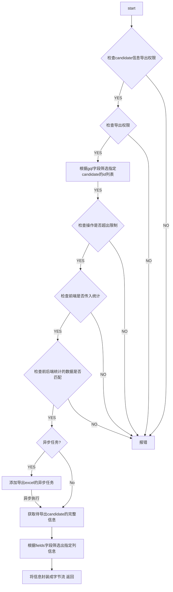

# Test

```mermaid
graph TB
	start[start] --> condition1{检查candidate信息导出权限}
	condition1 -- YES --> condition2{检查导出权限}
	condition2 -- YES --> do1[根据gql字段筛选指定candidate的id列表]
	do1 -- YES --> condition3{检查操作是否超出限制}
	condition3 -- YES --> condition4{检查前端是否传入统计}
	condition4 -- YES --> condition5{检查前后端统计的数据是否匹配}
	condition5 -- YES --> condition6{异步任务?}
	condition6 -- YES --> do2[添加导出excel的异步任务]
	condition6 -- No --> do3[获取待导出candidate的完整信息]
	do2 -- 异步执行 --> do3
	do3 --> do4[根据fields字段筛选出指定列信息]
	do4 --> do5[将信息封装成字节流 返回]
	condition1 -- NO --> do6[报错]
	condition2 -- NO --> do6[报错]
	condition3 -- NO --> do6[报错]
	condition4 -- NO --> do6[报错]
	condition5 -- NO --> do6[报错]
```

