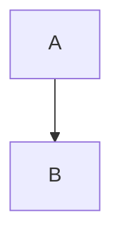
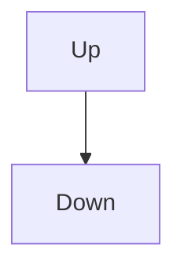
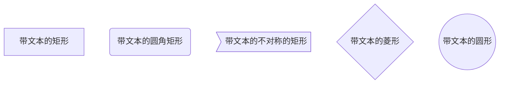
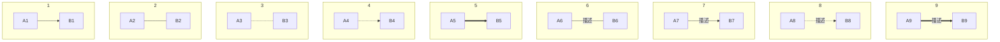
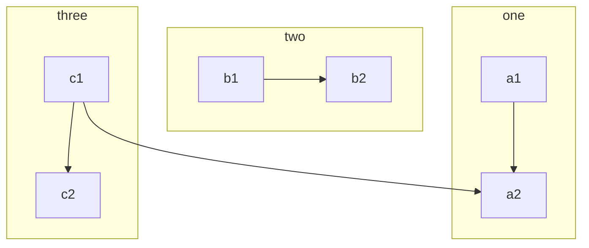
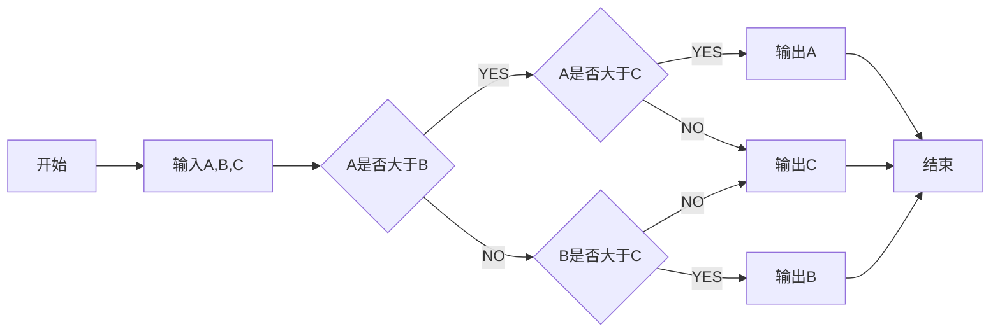
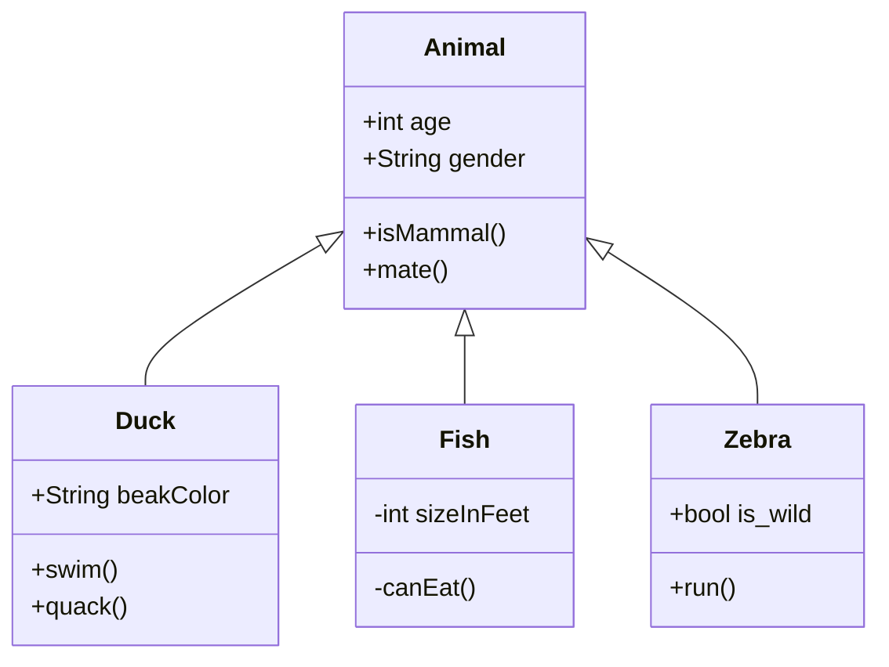
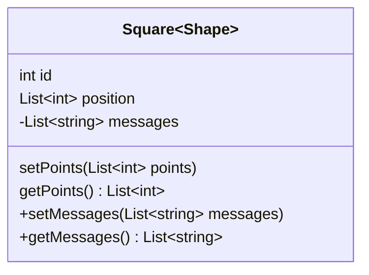
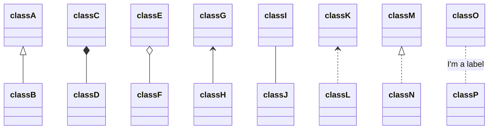
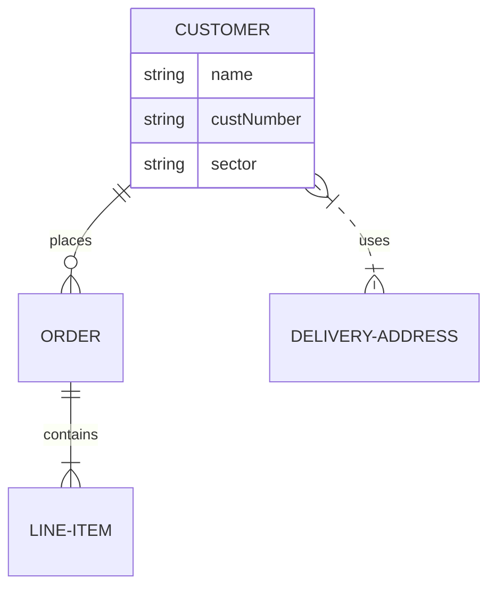

# mermaid

## FlowChart

````

````

### 方向

* TB 从上到下
* BT 从下到上
* RL 从右到左
* LR 从左到右
* TD 同 TB



### 基本图形

-  [带文本的矩形]
-  [(带文本的圆角矩形)
-  \>带文本的不对称的矩形]
-  {带文本的菱形}
-  ((带文本的圆形))

如果节点的文字中包含标点符号，需要时用双引号包裹起来

````

````



### 结点间连接

- A --> B   A 带箭头指向 B
- A --- B   A 不带箭头指向 B
- A -.- B   A 用虚线指向 B
- A -.-> B   A 用带箭头的虚线指向 B
- A ==> B   A 用加粗的箭头指向 B
- A -- 描述 --- B   A 不带箭头指向 B 并在中间加上文字描述
- A -- 描述 --> B   A 带箭头指向 B 并在中间加上文字描述
- A -. 描述 .-> B   A 用带箭头的虚线指向 B 并在中间加上文字描述
- A == 描述 ==> B   A 用加粗的箭头指向 B 并在中间加上文字描述



### 子流程图

````
```mermaid
subgraph title
    graph definition
end
```
````



### Demo

```
```mermaid
	graph LR
    start[开始] --> input[输入A,B,C]
    input --> conditionA{A是否大于B}
    conditionA -- YES --> conditionC{A是否大于C}
    conditionA -- NO --> conditionB{B是否大于C}
    conditionC -- YES --> printA[输出A]
    conditionC -- NO --> printC[输出C]
    conditionB -- YES --> printB[输出B]
    conditionB -- NO --> printC[输出C]
    printA --> stop[结束]
    printC --> stop
    printB --> stop
​```
```



## Class Diagram

````

````


### 定义类

1. 使用关键字 `class`
2. 使用关系符 `<|--` 定义两个类的关系

```
classDiagram
    class Animal
    Vehicle <|-- Car
```

### 定义属性、方法

Mermaid distinguishes between attributes and functions/methods based on if the **parenthesis** `()` are present or not

1. 使用 `:`
2. 使用 `{}`

```
 class BankAccount
 BankAccount : +String owner
 BankAccount : +BigDecimal balance
 BankAccount : +deposit(amount)
 BankAccount : +withdrawal(amount)
 
 class BankAccount{
    +String owner
    +BigDecimal balance
    +deposit(amount)
    +withdrawl(amount)
}
```

#### 函数返回值

写在函数后

```
+withdrawl(amount) int
```

#### 设置泛型

使用 `~~` 包围

```
classDiagram
class Square~Shape~{
    int id
    List~int~ position
    setPoints(List~int~ points)
    getPoints() List~int~
}

Square : -List~string~ messages
Square : +setMessages(List~string~ messages)
Square : +getMessages() List~string~
```



#### 设置成员可视类型

- `+` Public
- `-` Private
- `#` Protected
- `~` Package/Internal

> *note* you can also include additional *classifiers* to a method definition by adding the following notations to the end of the method, i.e.: after the `()`:

> - `*` Abstract e.g.: `someAbstractMethod()*`
> - `$` Static e.g.: `someStaticMethod()$`

### 类关系

```
[classA][Arrow][ClassB]:LabelText
```

| Type  | Description   |
| ----- | ------------- |
| <\|-- | Inheritance   |
| *--   | Composition   |
| o--   | Aggregation   |
| -->   | Association   |
| --    | Link (Solid)  |
| ..>   | Dependency    |
| ..\|> | Realization   |
| ..    | Link (Dashed) |



## Entity Relationship Diagrams

```
erDiagram
    CUSTOMER ||--o{ ORDER : places
    ORDER ||--|{ LINE-ITEM : contains
    CUSTOMER }|..|{ DELIVERY-ADDRESS : uses
```



```
<first-entity> [<relationship> <second-entity> : <relationship-label>]
```

| Value (left) | Value (right) | Meaning                       |
| ------------ | ------------- | ----------------------------- |
| `|o`         | `o|`          | Zero or one                   |
| `||`         | `||`          | Exactly one                   |
| `}o`         | `o{`          | Zero or more (no upper limit) |
| `}|`         | `|{`          | One or more (no upper limit)  |

